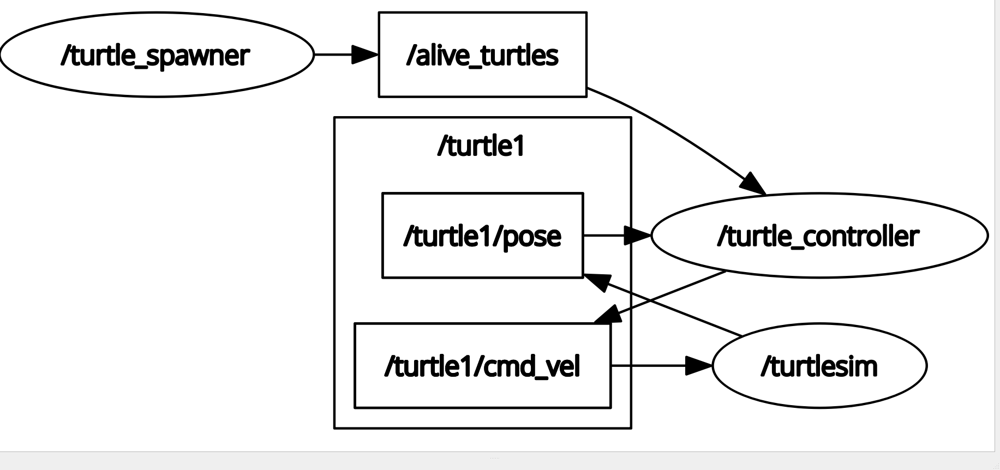

# 🐢 Turtle Catcher ROS2 Project

## 📌 Overview

This is a ROS2 multi-package robotics simulation project using `turtlesim`.

The system simulates a simple autonomous behavior where:
- One turtle is spawned at random positions
- Another turtle is controlled to chase and catch it
- Communication is handled using ROS2 topics, services, and custom interfaces

---

## 🧠 Concept

The project follows a basic robotics loop:

**Sense → Decide → Act**

- Sense: Read turtle positions from turtlesim done
- Decide: Compute direction toward target turtle 
- Act: Publish velocity commands to move the turtle

---

## 🚀 Features

- 🐢 Turtle simulation using turtlesim
- 🎯 Random turtle spawner node
- 🤖 Turtle controller node (chasing logic)
- 📡 Custom ROS2 messages and services
- ⚙️ Launch file to start full system
- 🧪 ROS2 test structure included

---

## 🧠 ROS2 Concepts and workflow Used

- Nodes (Publisher / Subscriber / Server / Client)
- Custom Messages (.msg)
- Custom Services (.srv)
- Launch files (XML)
- Parameters (YAML)
- Multi-package workspace design
  
"Two nodes power this project:
turtle_spawner.py — spawns and kills turtles by calling turtlesim's built-in Spawn and Kill services. It runs its own catch_turtle service server — when the controller catches a turtle, it sends the position here and this node handles the kill. Also has it own publisher which publishes topic alive_turtles.

turtle_controller.py — controls the main turtle. Subscribes to the Pose topic to track its own position, subscribes to the spawner's alive_turtles topic to know what to chase, calls catch_turtle when close enough, and publishes to cmd_vel to actually move."

"To get a clear picture of how the nodes and topics connect, check the rqt_graph here 👇"


---

## ⚙️ Build Instructions

```bash
colcon build
source install/setup.bash
```
---

## ▶️ Run the Project

```bash
ros2 launch my_robot_bringup turtle_catch_them_all.launch.xml
```
